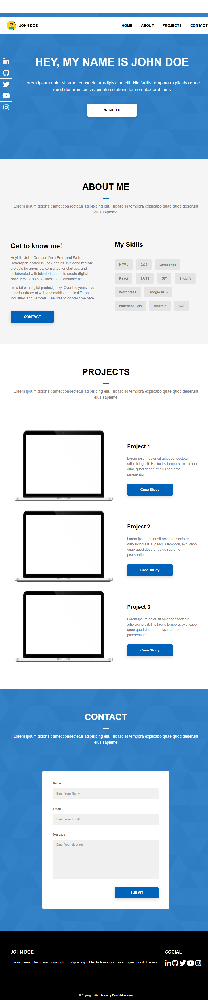

# Site-Ancora
Este projeto implementa um site âncora baseado em um modelo de portfólio, e tem como objetivo colocar em prática os conhecimentos adquiridos em: HTML semântico, CSS Grid, CSS Flexbox, Media Queries e  SASS.

## Tecnologias
- [HTML](https://developer.mozilla.org/en-US/docs/Web/HTML "HTML")
- [CSS Grid](https://developer.mozilla.org/en-US/docs/Learn/CSS/CSS_layout/Grids "CSS Grid")
- [CSS Flexbox](https://developer.mozilla.org/en-US/docs/Learn/CSS/CSS_layout/Flexbox "CSS Flexbox")
- [Media Queries](https://developer.mozilla.org/en-US/docs/Learn/CSS/CSS_layout/Media_queries "Media Queries")
- [SASS](https://sass-lang.com/guide/ "SASS")